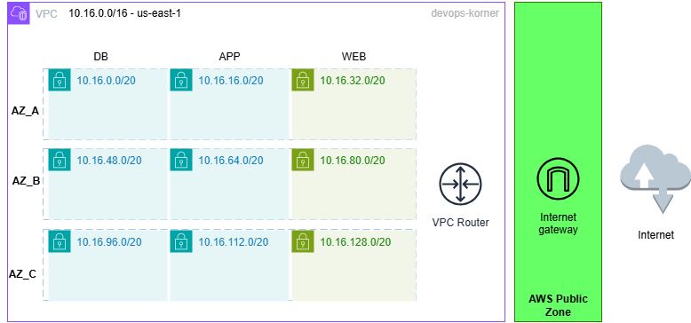

# aws-custom-vpc-module



This module create, by default, a VPC with in 3 AZs for 3 tiers:
- 6 privates subnets (`3 for db tier`, `3 for app tier`)
- 3 publics subnets for `web tier`

Each tier has one subnet in each AZs for resilience. 

## Test

```
module "vpc" {
  source           = "github.com/hotiaDiallo/aws-custom-vpc-module"
  vpc_cidr         = var.vpc_cidr
  name_prefix      = var.name_prefix
  web_subnet_cidrs = var.web_subnet_cidrs
  app_subnet_cidrs = var.app_subnet_cidrs
  db_subnet_cidrs  = var.db_subnet_cidrs
}
```

`variables.tf` examples: 

```
variable "vpc_cidr" {
  default = "10.16.0.0/16"
}

variable "name_prefix" {
  default = "devops-korner"
}

variable "web_subnet_cidrs" {
  default = ["10.16.32.0/20", "10.16.80.0/20", "10.16.128.0/20"]
}

variable "app_subnet_cidrs" {
  default = ["10.16.16.0/20", "10.16.64.0/20", "10.16.112.0/20"]
}

variable "db_subnet_cidrs" {
  default = ["10.16.0.0/20", "10.16.48.0/20", "10.16.96.0/20"]
}
```